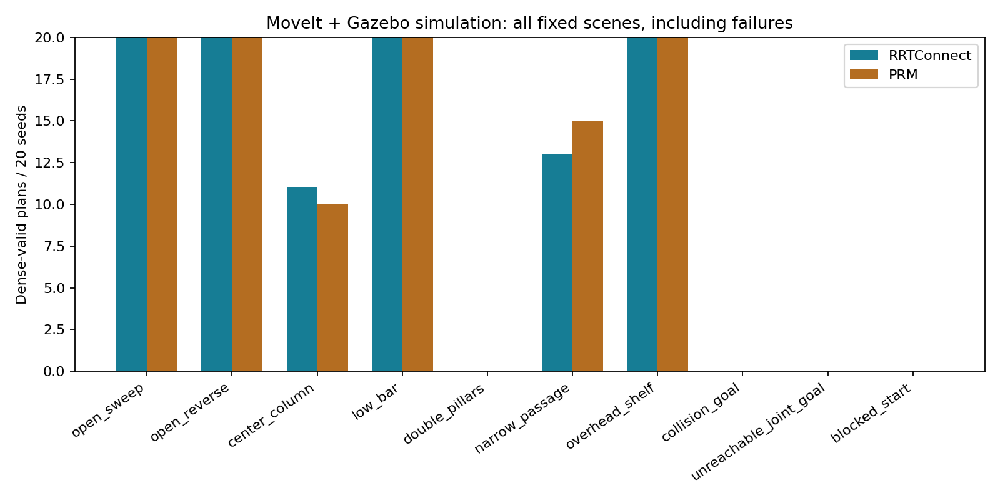
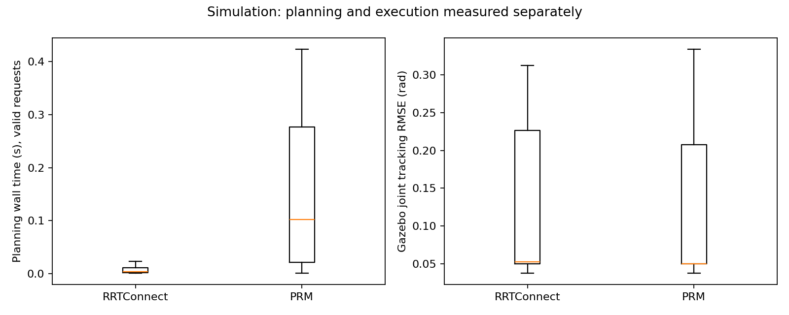

# ArmBench

A six-DOF arm planning and execution benchmark using ROS2 Humble, MoveIt OMPL and Gazebo Classic. Simulation only.

## Limits first

- No hardware result, branded robot model, identified inertias or real-arm accuracy claim. Geometry is procedural; principal inertias are synthetic with a .005 kg m2 minimum.
- This is a small fixed-scene benchmark, not proof one planner is universally better. Four scenes have invalid start/goal requests; these are reported separately, not counted as planner timeouts.
- Successful planning is not safe execution. Dense-valid plans can fail tracking and sampled collision/bounds checks. The low-bar scene fails execution for every test seed.
- Collision checks use .01-rad joint interpolation for plans and .01-s sampling of executed states. Neither is a continuous collision guarantee. Collision vs bounds invalidity is pooled in the execution-valid flag.
- Gazebo execution uses an embedded C++ dynamic world, not a ROS2 hardware driver or ros2_control deployment. The planner uses ROS2/MoveIt APIs; Python handles reproducibility, auditing and plots.
- Timing is machine-dependent. Fresh processes seed OMPL separately; roadmap reuse is deliberately disabled. No cross-machine timing claim.
- No held-out tuning. Development controller failures remain under `results/dev`; they are not evaluation evidence.

## Question and method

How do RRTConnect and PRM compare on identical joint-space start/goal cases, and do their collision-valid plans track during torque-driven simulated execution?

Ten scenes x 20 held-out seeds x two planners = 400 attempts. One planning attempt, 1-second solve budget, fresh process/context, fixed scene/model/controller hashes. Evaluation seeds 0-19; development seeds 1000-1099.

Planner wall timing measures solve only, excluding process startup, MoveIt/plugin construction, dense post-checking and Gazebo execution. Invalid request rows record zero solve time and are excluded from valid-request timing summaries. No timeouts occurred in this dataset; 31 nominally successful plans were rejected by the denser collision check.

Execution: 1-ms Gazebo ODE steps, torque-limited PD (30 Nm), command segments at <=0.5 rad/s, .5-s initial/terminal holds. Actual joint states are recorded every .01 simulated seconds; pooled tracking includes both holds. Initial state positioning is done before execution; no teleportation drives the measured path.

## MEASURED results

| Measure | RRTConnect | PRM |
|---|---:|---:|
| Attempts | 200 | 200 |
| Invalid goal / invalid start | 60 / 20 | 60 / 20 |
| Planner-returned solutions | 120 | 120 |
| Dense collision-valid plans | 104 | 105 |
| Gazebo executions completed | 104 | 105 |
| Tracking pass, RMSE <=0.15 rad | 77 | 76 |
| Sampled execution bounds/collision valid | 74 | 75 |
| Valid-request solve median | 0.00404 s | 0.10229 s |
| Valid-request solve p95 | 0.01536 s | 0.40399 s |
| Valid-plan path length median | 1.32287 rad | 1.32288 rad |
| Executed joint RMSE median | 0.05254 rad | 0.05027 rad |
| Executed joint RMSE p95 | 0.26650 rad | 0.25187 rad |

Counts use all 200 attempts per planner. Timing uses the 120 valid requests per planner. Path and tracking distributions use only their stated valid-plan/execution subsets; do not quote these without the denominator.





[Complete raw CSV](report/raw.csv), [JSONL](report/raw.jsonl), [summary and per-scene breakdown](report/summary.json), [frozen inputs](results/evaluation/manifest.json), [hardware](results/evaluation/hardware.json), [protocol](config/PREREGISTRATION.md).

## Negative findings and positive controls

- Low-bar: all 40 planned paths pass dense validation, yet all 40 fail tracking and sampled execution validation. Planning does not make this controller safe.
- Center-column and narrow-passage cases have dense-invalid planner paths and some unsafe execution. These are retained, not retuned away.
- Double-pillars, collision-goal and unreachable-joint-goal scenes contain invalid goals; blocked-start is invalid. They test rejection, not search quality.
- Both obstacle-free evaluation scenes pass tracking and sampled execution checks for all 80 attempts. A dedicated development-seed short-path positive control also passes with the same settings, as does the fresh integration test. The low-bar failures are not a blanket failure of every control case.
- Early development attempts used unstable tiny inertias/damping. Their non-finite traces are preserved but are invalid development evidence; they were fixed before evaluation. Tests require every evaluated trace to be finite and recompute its RMSE.

[Demo](report/demo.mp4) reconstructs actual recorded Gazebo joint states with forward kinematics. Both planners, seed 0, fixed scenes 0 and 3: passing control and failing case. It is not a live Gazebo camera recording, hardware video or a selected success-only reel.

## One-command setup, run, test and report

```sh
bash scripts/reproduce.sh
```

Ubuntu/Linux x86_64, Python 3.10 for plotting, several GB disk space. The script installs the exact conda distribution in `conda-linux-64.lock`, compiles serially, resumes the 400-run suite, audits/traces/tests, regenerates plots/demo and performs a fresh actual-stack integration run. Runtime is CPU-only; no GPU needed.

Saved result keys resume instead of rerunning. For an independent full rerun, move `results/evaluation` aside first. Frozen-input changes refuse mixed results. The lock uses prebuilt RoboStack ROS2/MoveIt/Gazebo binaries; clean installation and local execution were verified, while final CI status is checked separately.

## Architecture

Original URDF/SRDF and equivalent SDF boxes -> ROS2 node -> MoveIt planning scene + OMPL plugin -> fresh planner context -> dense post-validation -> Gazebo dynamic execution -> joint traces -> Python complete-dataset audit -> CSV/JSON/plots/demo.

Next work should preserve this v1 baseline: use a new preregistration for controller improvements, finer collision resolution, more varied scenes and Cartesian goals. The current unreachable case is a joint-limit violation, not a full inverse-kinematics benchmark.

## Licenses

Original code/model: MIT. Dependencies keep their own licenses; see `THIRD_PARTY_NOTICES.md`. No external robot meshes or datasets. No CI badge until the complete live workflow passes.
